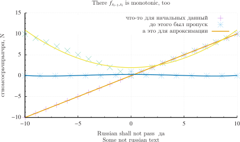

# PyGnuTex

### Пример использования

```python

import aprox
import gnuGraph
import numpy as np


o1 = [-10,-9,-8,-7,-6,-5,-4,-3,-2,-1,0,1,2,3,4,5,6,7,8,9,10]
o2 = [-10,-9,-8,-7,-6,-5,-4,-3,-2,-1,0,1,2,3,4,5,6,7,8,9,10]

def pli(var):
    return 2.7**(-var**2)

h = np.linspace(-10, 10, 15)
hh = list(map(pli, h))

a1 = [-10,-9,-8,-7,-6,-5,-4,-3,-2,-1,0,1,2,3,4,5,6,7,8,9,10]
a2 = [10,9,8,7,6,5,4,3,2,1,0,1,2,3,4,5,6,7,8,9,10]


gnuGraph.SciPlot(o1, o2, a1, a2, h, hh, 
                 aprx=[[4, 2], [2, 2]], 
                 xlabel="Russian shall not pass  $=$да",
                 ylabel="сгномсосрьчпрьпчрп, N",
                 label="Some not russian text", 
                 title="There $f_{[x_{i-1},x_i]}$  is monotonic, too", 
                 name="crap2", origKeys=["что-то для начальных данный", "", "до этого был пропуск"], 
                 aprxKeys="а это для апроксимации")

gnuGraph.dispSVG("crap2PDF.svg")
```

